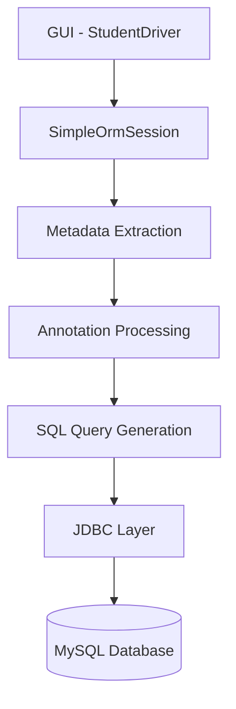

<!-- PROJECT BANNER -->

<p align="center">
  
</p>

<p align="center">


</p>

---

# Simple ORM Framework (Java)

A **lightweight Object Relational Mapping framework built from scratch in Java** using:

- JDBC
- Java Reflection
- Custom Annotations
- Metadata Extraction
- Dynamic SQL Generation
- Entity Caching
- Swing GUI Client

This project demonstrates **how Java objects can be mapped to relational database tables without external ORM frameworks**.

Instead of relying on large persistence frameworks, this project implements the **core concepts of an ORM internally**, including annotation processing, metadata extraction, SQL generation, and entity persistence.

---

# Demo (GUI)

The project includes a **Java Swing application** to interact with the ORM.

Users can:

- Insert Students
- Find Students
- Update Students
- Delete Students
- View All Records

### GUI Preview


---

# Architecture

Below is the internal flow of the ORM framework.



### Explanation

1️⃣ **Swing GUI**

User interacts with the Student Manager UI.

2️⃣ **ORM Session**

Handles:

- save()
- findById()
- update()
- delete()
- findAll()

3️⃣ **Metadata Extractor**

Uses reflection to extract:

- table names
- column mappings
- primary keys

4️⃣ **SQL Generator**

Builds queries dynamically.

5️⃣ **JDBC Layer**

Executes prepared statements.

---

# Annotation Based Entity Mapping

The ORM framework supports custom annotations.

Example:

```java
@Entity
@Table(name = "students")
public class Student {

    @Id
    @Column(name="roll_number")
    private Integer rollNumber;

    @Column(name="name")
    private String name;

    @Column(name="age")
    private Integer age;

}
```

### Supported Annotations

| Annotation | Purpose |
|--------|--------|
| `@Entity` | Marks class as ORM entity |
| `@Table` | Maps entity to DB table |
| `@Column` | Maps field to column |
| `@Id` | Identifies primary key |

The ORM reads these annotations **at runtime using Java Reflection**.

---

# Reflection Based Metadata Extraction

The framework dynamically extracts metadata.

Example methods:

```java
OrmMetadataExtractor.getTableName(clazz)

OrmMetadataExtractor.getPrimaryKeyFieldName(clazz)

OrmMetadataExtractor.getColumnName(field)
```

Reflection allows the ORM to:

- discover entity classes
- read annotations
- map fields to database columns
- dynamically generate SQL queries

---

# ORM Operations Implemented

| Operation | Description |
|--------|--------|
| `save()` | Inserts entity |
| `findById()` | Fetch record by primary key |
| `update()` | Update entity |
| `delete()` | Remove entity |
| `findAll()` | Retrieve all records |

Example:

```java
Student s = new Student();

s.setRollNumber(101);
s.setName("John");
s.setAge(21);

session.save(s);
```

---

# Caching

A **basic entity caching mechanism** is implemented inside the ORM session.

This helps reduce repeated database queries by temporarily storing retrieved entities.

Benefits:

- reduced database hits
- improved response time
- demonstrates ORM caching concepts

---

# Database Setup

Currently **database and tables must be created manually**.

Example MySQL schema:

```sql
CREATE TABLE students (
    id BIGINT AUTO_INCREMENT PRIMARY KEY,
    roll_number INT UNIQUE,
    name VARCHAR(100),
    age INT,
    course VARCHAR(100)
);
```

Future versions may support **automatic schema generation**.

---

# Project Structure (Maven)

```
src
 └── main
     └── java
         └── com
             └── yourcompany
                 └── simpleorm
                     ├── annotation
                     │     ├── Entity.java
                     │     ├── Table.java
                     │     ├── Column.java
                     │     └── Id.java
                     │
                     ├── jdbc
                     │     └── ConnectionManager.java
                     │
                     ├── metadata
                     │     └── OrmMetadata.java
                     │
                     ├── util
                     │     └── OrmMetadataExtractor.java
                     │
                     ├── session
                     │     └── SimpleOrmSession.java
                     │
                     └── simple_orm_framework
                           ├── Student.java
                           ├── StudentDriver.java
                           └── App.java
```

---

# Running the Application

Since this is a **Maven project**, run the GUI from:

```
src/main/java/com/yourcompany/simpleorm/simple_orm_framework
```

Run:

```
StudentDriver.java
```

This launches the **Student Manager GUI**.

---

# Future Improvements

Planned enhancements:

### Automatic Table Creation

```
createTableIfNotExists()
```

### Foreign Key Mapping

Example future annotation:

```
@ManyToOne
@JoinColumn
```

### Relationship Mapping

- One-to-Many
- Many-to-One
- Many-to-Many

### Join Query Builder

Automatically generate SQL joins.

### Query Builder API

Example future usage:

```java
session.query(Student.class)
       .where("age > 20")
       .orderBy("name")
       .list();
```

### Lazy Loading

Load related entities only when needed.

---

# What I Learned From This Project

Building an ORM framework provided hands-on experience with:

### ORM Architecture

- Object to relational mapping
- dynamic SQL generation
- entity persistence

### Java Reflection

- reading annotations
- inspecting fields dynamically
- metadata extraction

### JDBC

- connection handling
- prepared statements
- result set mapping

### Framework Design

- session management
- caching strategies
- modular architecture

### GUI Integration

Using **Java Swing** to build a desktop client interacting with the persistence layer.

---

# Author

**Sushobhit Chattaraj**

Backend Developer | Java | Systems Design

---

<p align="center">
  
</p>