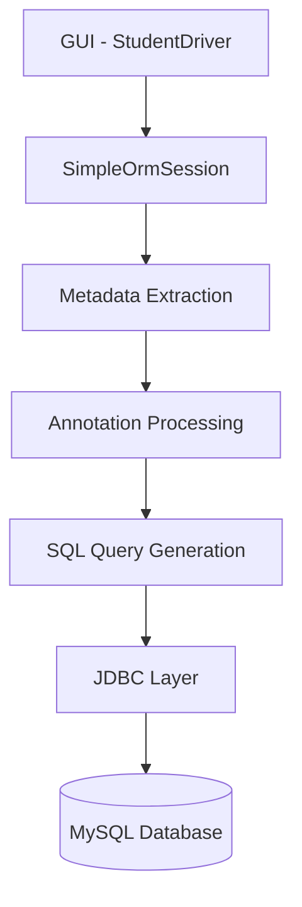

<!-- PROJECT BANNER -->

<p align="center">
  
</p>

<p align="center">


</p>

---    

# Simple ORM Framework (Java)

A **lightweight Object Relational Mapping framework built from scratch in Java** using:

- JDBC
- Java Reflection
- Custom Annotations
- Metadata Extraction
- Dynamic SQL Generation
- Entity Caching
- Swing GUI Client

This project demonstrates **how Java objects can be mapped to relational database tables without external ORM frameworks**.

Instead of relying on large persistence frameworks, this project implements the **core concepts of an ORM internally**, including annotation processing, metadata extraction, SQL generation, and entity persistence.

---

# Demo (GUI)

The project includes a **Java Swing application** to interact with the ORM.

Users can:

- Insert Students
- Find Students
- Update Students
- Delete Students
- View All Records

### GUI Preview


---

# Architecture

Below is the internal flow of the ORM framework.



### Explanation

1️⃣ **Swing GUI**

User interacts with the Student Manager UI.

2️⃣ **ORM Session**

Handles:

- save()
- findById()
- update()
- delete()
- findAll()

3️⃣ **Metadata Extractor**

Uses reflection to extract:

- table names
- column mappings
- primary keys

4️⃣ **SQL Generator**

Builds queries dynamically.

5️⃣ **JDBC Layer**

Executes prepared statements.

---

# ⚙️ Internal Execution Workflow

This section explains **how the application actually runs internally**, starting from launching the application to performing database operations.

---

# 1️⃣ Application Startup (App.java)

### File
```
App.java
```

### What happens

When you run:

```java
public static void main(String[] args) {
    new StudentDriver();
}
```

### Call Flow

```
App.java
   ↓
StudentDriver constructor
```

So **App.java does only one thing**

➡ Launches the GUI application.

---

# 2️⃣ GUI Initialization

### File

```
StudentDriver.java
```

### Constructor runs

```java
public StudentDriver()
```

### Step-by-step execution

---

## 1. Create database connection

```
StudentDriver
   ↓
ConnectionManager
```

Code:

```java
ConnectionManager manager = new ConnectionManager();
Connection conn = manager.getConnection();
```

Class used:

```
jdbc/ConnectionManager.java
```

Inside it:

```
DriverManager.getConnection(...)
```

So the actual chain becomes:

```
StudentDriver
   ↓
ConnectionManager
   ↓
DriverManager
   ↓
MySQL Database
```

---

## 2. Create ORM Session

Back in `StudentDriver`:

```java
session = new SimpleOrmSession(conn);
```

This initializes:

```
session/SimpleOrmSession.java
```

This object becomes the **core ORM engine**.

All CRUD operations flow through:

```
StudentDriver
   ↓
SimpleOrmSession
```

---

## 3. GUI components created

Inside constructor:

- JFrame
- JPanel
- JButton
- JTextField
- JTextArea

Buttons created:

```
Insert
Find
Delete
View All
Update
```

Each button registers an **ActionListener**.

Example:

```java
insertBtn.addActionListener(e -> showInsertForm());
```

Clicking the button triggers:

```
StudentDriver.showInsertForm()
```

---

# 3️⃣ INSERT Operation Lifecycle

### User Flow

```
User clicks Insert
↓
GUI shows form
↓
User enters data
↓
User clicks ENTER
↓
performAction()
```

---

## Step 1

```
StudentDriver.showInsertForm()
```

This function builds the form fields.

```
Roll number
Name
Age
Course
```

No database interaction yet.

---

## Step 2

User clicks **ENTER**

```
StudentDriver.performAction()
```

Code branch:

```
case "INSERT"
```

---

## Step 3

Entity object created

```java
Student s = new Student();
```

Class used:

```
simple_orm_framework/Student.java
```

This is an **ORM Entity**.

Annotations used:

```
@Entity
@Table
@Column
@Id
```

---

## Step 4

Driver fills the entity:

```java
s.setRollNumber(...)
s.setName(...)
s.setAge(...)
s.setCourse(...)
```

Now we have:

```
Student object in memory
```

---

## Step 5

Driver calls ORM:

```java
session.save(s)
```

Call flow:

```
StudentDriver
   ↓
SimpleOrmSession.save()
```

---

# 4️⃣ What Happens Inside save()

File:

```
SimpleOrmSession.java
```

Function:

```
save(Object entity)
```

---

### Step 1 — Metadata Extraction

```
OrmMetadataExtractor.getMetadata(entityClass)
```

Class used:

```
util/OrmMetadataExtractor.java
```

Reflection reads annotations:

```
@Entity
@Table
@Column
@Id
```

Reflection process:

```
Class<?> clazz = entity.getClass()

clazz.getDeclaredFields()
```

Extracted metadata:

```
Table name
Primary key field
Column names
```

---

### Step 2 — Metadata Object Created

Class used:

```
metadata/OrmMetadata.java
```

Stores:

```
tableName
primaryKeyField
columnNames
```

Now ORM understands:

```
students table
roll_number column
name column
age column
course column
```

---

### Step 3 — SQL Generation

SQL dynamically generated:

```
INSERT INTO students (roll_number,name,age,course)
VALUES (?,?,?,?)
```

---

### Step 4 — PreparedStatement Creation

```
connection.prepareStatement(sql)
```

Flow:

```
SimpleOrmSession
   ↓
Connection
   ↓
PreparedStatement
```

---

### Step 5 — Parameter Binding

Reflection extracts values:

```
field.get(entity)
```

Example:

```
roll_number → 101
name → John
age → 21
course → CS
```

Prepared statement:

```
ps.setObject(...)
```

---

### Step 6 — Execute Query

```
ps.executeUpdate()
```

Database operation:

```
MySQL
INSERT row
```

---

### Step 7 — Session Cache Update

Your ORM includes **entity caching**.

Structure:

```
Map<Class<?>, Map<Object, Object>>
```

Meaning:

```
EntityClass → PrimaryKey → Object
```

Entity may now be stored in cache.

---

### Step 8 — Control Returns

```
SimpleOrmSession
   ↓
StudentDriver
```

GUI prints:

```
Student inserted successfully
```

---

# 5️⃣ FIND Operation Lifecycle

User flow:

```
Find button
↓
Enter roll number
↓
ENTER
```

Step 1

```
StudentDriver.performAction()
```

Branch:

```
case "FIND"
```

---

### Step 2

Driver calls helper method:

```
findByRollNumber()
```

Currently implemented using **manual JDBC query**.

Flow:

```
StudentDriver
   ↓
ConnectionManager
   ↓
PreparedStatement
   ↓
ResultSet
```

SQL executed:

```
SELECT * FROM students WHERE roll_number=?
```

---

### Step 3

ResultSet read

```
rs.getInt
rs.getString
```

---

### Step 4

Student object created

```
Student s = new Student()
```

---

### Step 5

Returned as:

```
Optional<Student>
```

---

### Step 6

GUI displays result

```
Name
Age
Course
```

---

# 6️⃣ UPDATE Operation Lifecycle

User flow:

```
Update button
↓
Enter roll number
↓
Enter new values
↓
ENTER
```

Step 1

```
StudentDriver.performAction()
```

Branch:

```
UPDATE
```

---

### Step 2

Driver fetches existing record

```
findByRollNumber()
```

---

### Step 3

Entity updated

```
student.setName(...)
student.setAge(...)
student.setCourse(...)
```

---

### Step 4

Driver calls ORM

```
session.update(student)
```

---

# 7️⃣ Inside update()

Metadata extracted again.

Primary key detected:

```
@Id → roll_number
```

SQL generated:

```
UPDATE students
SET name=?,age=?,course=?
WHERE roll_number=?
```

PreparedStatement executed:

```
ps.executeUpdate()
```

Cache entry updated.

---

# 8️⃣ DELETE Operation Lifecycle

User flow:

```
Delete
↓
Enter roll number
↓
ENTER
```

Driver fetches entity:

```
findByRollNumber()
```

Then calls:

```
session.delete(student)
```

SQL executed:

```
DELETE FROM students
WHERE roll_number=?
```

Cache entry removed.

---

# 9️⃣ VIEW ALL Operation Lifecycle

User clicks **View All**

Driver calls:

```
session.findAll(Student.class)
```

Inside ORM:

```
SELECT roll_number,name,age,course
FROM students
```

Each row mapped to:

```
Student object
```

Returned as:

```
List<Student>
```

Displayed in GUI.

---

# Annotation Based Entity Mapping

The ORM framework supports custom annotations.

Example:

```java
@Entity
@Table(name = "students")
public class Student {

    @Id
    @Column(name="roll_number")
    private Integer rollNumber;

    @Column(name="name")
    private String name;

    @Column(name="age")
    private Integer age;

}
```

### Supported Annotations

| Annotation | Purpose |
|--------|--------|
| `@Entity` | Marks class as ORM entity |
| `@Table` | Maps entity to DB table |
| `@Column` | Maps field to column |
| `@Id` | Identifies primary key |

The ORM reads these annotations **at runtime using Java Reflection**.

---

# Reflection Based Metadata Extraction

The framework dynamically extracts metadata.

Example methods:

```java
OrmMetadataExtractor.getTableName(clazz)

OrmMetadataExtractor.getPrimaryKeyFieldName(clazz)

OrmMetadataExtractor.getColumnName(field)
```

Reflection allows the ORM to:

- discover entity classes
- read annotations
- map fields to database columns
- dynamically generate SQL queries

---

# ORM Operations Implemented

| Operation | Description |
|--------|--------|
| `save()` | Inserts entity |
| `findById()` | Fetch record by primary key |
| `update()` | Update entity |
| `delete()` | Remove entity |
| `findAll()` | Retrieve all records |

Example:

```java
Student s = new Student();

s.setRollNumber(101);
s.setName("John");
s.setAge(21);

session.save(s);
```

---

# Caching

A **basic entity caching mechanism** is implemented inside the ORM session.

This helps reduce repeated database queries by temporarily storing retrieved entities.

Benefits:

- reduced database hits
- improved response time
- demonstrates ORM caching concepts

---

# Database Setup

Currently **database and tables must be created manually**.

Example MySQL schema:

```sql
CREATE TABLE students (
    id BIGINT AUTO_INCREMENT PRIMARY KEY,
    roll_number INT UNIQUE,
    name VARCHAR(100),
    age INT,
    course VARCHAR(100)
);
```

Future versions may support **automatic schema generation**.

---

# Project Structure (Maven)

```
src
 └── main
     └── java
         └── com
             └── yourcompany
                 └── simpleorm
                     ├── annotation
                     │     ├── Entity.java
                     │     ├── Table.java
                     │     ├── Column.java
                     │     └── Id.java
                     │
                     ├── jdbc
                     │     └── ConnectionManager.java
                     │
                     ├── metadata
                     │     └── OrmMetadata.java
                     │
                     ├── util
                     │     └── OrmMetadataExtractor.java
                     │
                     ├── session
                     │     └── SimpleOrmSession.java
                     │
                     └── simple_orm_framework
                           ├── Student.java
                           ├── StudentDriver.java
                           └── App.java
```

---

# Running the Application

Since this is a **Maven project**, run the GUI from:

```
src/main/java/com/yourcompany/simpleorm/simple_orm_framework
```

Run:

```
StudentDriver.java
```

This launches the **Student Manager GUI**.

---

# Future Improvements

Planned enhancements:

### Automatic Table Creation

```
createTableIfNotExists()
```

### Foreign Key Mapping

Example future annotation:

```
@ManyToOne
@JoinColumn
```

### Relationship Mapping

- One-to-Many
- Many-to-One
- Many-to-Many

### Join Query Builder

Automatically generate SQL joins.

### Query Builder API

Example future usage:

```java
session.query(Student.class)
       .where("age > 20")
       .orderBy("name")
       .list();
```

### Lazy Loading

Load related entities only when needed.

---

# What I Learned From This Project

Building an ORM framework provided hands-on experience with:

### ORM Architecture

- Object to relational mapping
- dynamic SQL generation
- entity persistence

### Java Reflection

- reading annotations
- inspecting fields dynamically
- metadata extraction

### JDBC

- connection handling
- prepared statements
- result set mapping

### Framework Design

- session management
- caching strategies
- modular architecture

### GUI Integration

Using **Java Swing** to build a desktop client interacting with the persistence layer.

---

# Author

**Sushobhit Chattaraj**

Backend Developer | Java | Systems Design

---

<p align="center">
  
</p>
